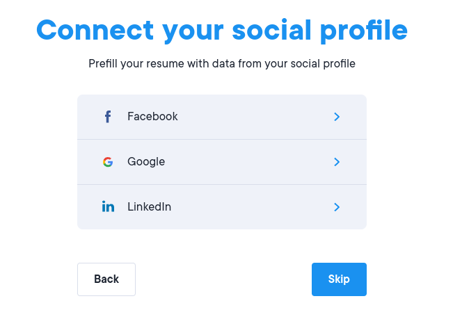
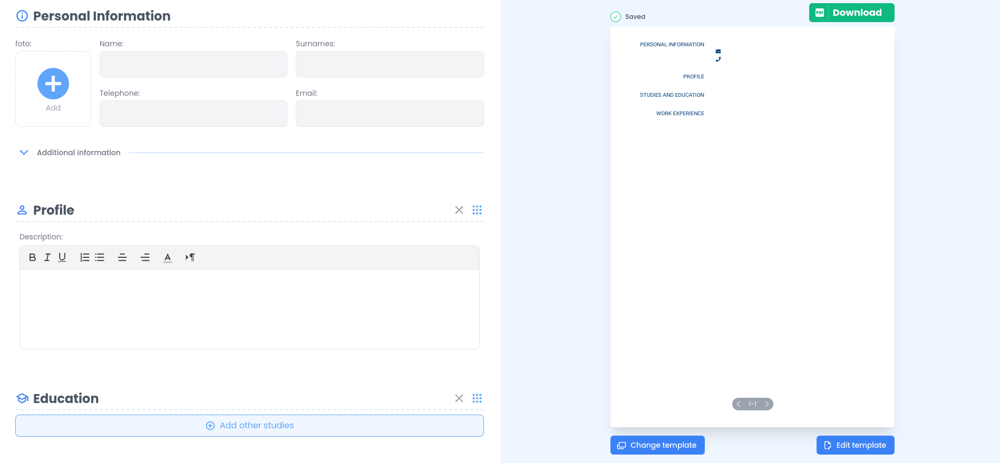
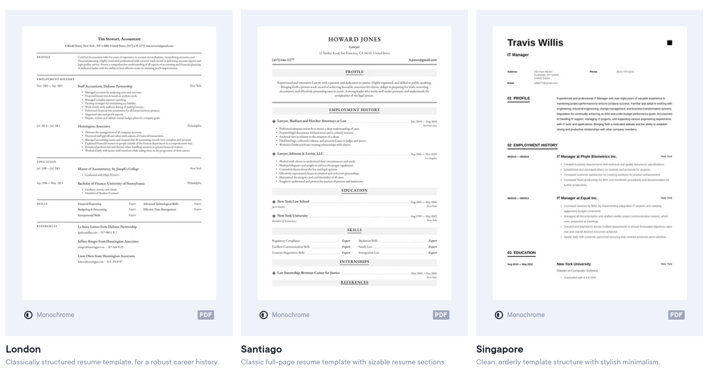
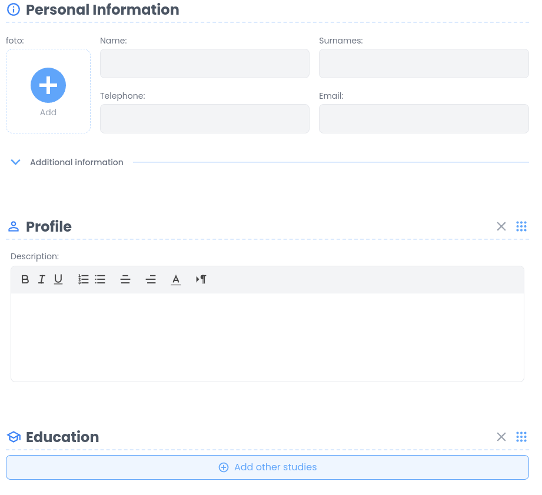

# Требования к проекту
---
 
# Содержание
1 [Введение](#intro)
1.1 [Назначение](#appointment)
1.2 [Бизнес-требования](#business_requirements)
1.3 [Аналоги](#analogues)
2 [Требования пользователя](#user_requirements)
2.1 [Программные интерфейсы](#software_interfaces)
2.2 [Интерфейс пользователя](#user_interface)
2.3 [Характеристики пользователей](#user_specifications)
2.3.1 [Классы пользователей](#user_classes)
2.3.2 [Аудитория приложения](#application_audience)
2.3.2.1 [Целевая аудитория](#target_audience)
2.3.2.1 [Побочная аудитория](#collateral_audience)
2.4 [Предположения и зависимости](#assumptions_and_dependencies)
3 [Системные требования](#system_requirements)
3.1 [Функциональные требования](#functional_requirements)
3.1.1 [Основные функции](#main_functions)
3.1.1.1 [Вход пользователя в приложение](#user_login_to_the_application)
3.1.1.2 [Взаимодействие с блоком создания элементов](#interaction_with_creation_blocks)
3.1.1.3 [Взаимодействие с блоком сохранения резюме](#interaction_with_save_block)
3.1.1.4 [Выход пользователя из учётной записи](#active_user_change)
3.1.1.5 [Регистрация нового пользователя после входа в приложение](#new_user_registration)
3.1.2 [Ограничения и исключения](#restrictions_and_exclusions)
3.2 [Нефункциональные требования](#non-functional_requirements)
3.2.1 [Атрибуты качества](#quality_attributes)
3.2.1.1 [Требования к удобству использования](#requirements_for_ease_of_use)
3.2.1.2 [Требования к безопасности](#security_requirements)
3.2.2 [Внешние интерфейсы](#external_interfaces)
3.2.3 [Ограничения](#restrictions)
 
<a name="intro"/>
 
# 1 Введение
 
<a name="appointment"/>
 
## 1.1 Назначение
В этом документе описаны функциональные и нефункциональные требования к веб-приложению для создания резюме «CV Builder». Этот документ предназначен для команды, которая будет реализовывать и проверять корректность работы приложения.
 
<a name="business_requirements"/>
 
## 1.2 Бизнес-требования
Приложение обеспечивает возможности:
1. пользователю - составить и заполнить резюме;
2. пользователю - сохранить составленное резюме на физический носитель;
3. зарегистрированному пользователю - иметь несколько сохраненных резюме, привязанных к аккаунту;
4. владельцу - предлагать различные шаблоны резюме и дополнительные услуги для увеличения продаж.

<a name="analogues"/>

## 1.3 Аналоги
Обзор аналогов представлен в документе [analogues](./analogues.md).

<a name="user_requirements"/>

# 2 Требования пользователя
 
<a name="software_interfaces"/>

## 2.1 Программные интерфейсы
Данные об участниках команды будут браться из баз данных на сервере.
 
<a name="user_interface"/>
 
## 2.2 Интерфейс пользователя
Окно входа в приложение.  
)  
Главное окно приложения.  
  
Окно выбора шаблона.  
  
Окно редактирования информационных полей.  
  
<a name="user_specifications"/>
 
## 2.3 Характеристики пользователей
 
<a name="user_classes"/>
 
### 2.3.1 Классы пользователей
 
| Класс пользователей | Описание |
|:---|:---|
| Зарегистрированные пользователи | Пользователи, которые вошли в приложение под своим именем (псевдонимом). Имеют доступ к сохраненным резюме, имеют возможность использования дополнительных шаблонов |
| Незарегистрированные пользователи | Пользователи, не  |
 
<a name="application_audience"/>
 
### 2.3.2 Аудитория приложения
 
<a name="target_audience"/>
 
#### 2.3.2.1 Целевая аудитория
Люди послешкольного возраста, заинтересованные в поиске работы.

<a name="collateral_audience"/>
 
#### 2.3.2.2 Побочная аудитория
Люди любых возрастов, имеющие подключение к Интернету, не заинтересованные в поисках работы.
 
<a name="assumptions_and_dependencies"/>
 
## 2.4 Предположения и зависимости
1. Приложение не работает при отсутствии подключения к Интернету;
2. Количество шаблонов резюме ограничивается одним.
 
<a name="system_requirements"/>
 
# 3 Системные требования

<a name="functional_requirements"/>
 
## 3.1 Функциональные требования
 
<a name="main_functions"/>
 
### 3.1.1 Основные функции
 
<a name="user_login_to_the_application"/>
 
#### 3.1.1.1 Вход пользователя в приложение
**Описание.** Пользователь имеет возможность использовать приложение, войдя в свою учётную запись.
 
| Функция | Требования | 
|:---|:---|
| Вход в приложение без создания собственного профиля | Приложение должно попросить пользователя зарегистрироваться, либо войти в уже существующий аккаунт |
| <a name="registration_requirements"/>Регистрация нового пользователя | Приложение должно запросить у пользователя ввести адрес электронной почты и пароль, а также его подтвердить, для создания учётной записи. Пользователь должен либо ввести данные, либо отменить действие |
| *Пользователь с таким адресом существует* | *Приложение должно известить пользователя об ошибке регистрации и запросить ввод другого адреса электронной почты. Пользователь должен либо ввести данные, либо отменить действие* |
| *Недопустимый пароль* | *Приложение должно известить пользователя об ошибке регистрации и запросить ввод другого пароля. Пользователь должен либо ввести данные, либо отменить действие* |
| *Вход в приложение без входа в учетную запись* | *Приложение должно известить пользователя о том, что ему недоступны все функции приложения, и перенаправить его на главную страницу* |
| Вход зарегистрированного пользователя в приложение | Приложение направляет на главную страницу |
 
<a name="interaction_with_creation_blocks"/>
 
#### 3.1.1.2 Взаимодействие с блоком создания элементов
**Описание.** Пользователь в блоке создания резюме имеет возможность добавлять, редактировать или удалять созданные поля.
 
| Функция | Требования | 
|:---|:---|
| Добавление поля | Приложение должно предоставить пользователю новое поле соответствующей категории для ввода информации. Пользователь должен внести информацию и подтвердить либо отменить действие. |
| Удаление поля | Пользователь имеет возможность удалить созданное информационное поле. Пользователь должен либо подвердить действие, либо отменить его. |
| Выбор шаблона | Пользователь имеет вомзожность выбрать один из предоставленных приложением шаблонов для генерации резюме. |
| Создание резюме | Пользователь имеет возможность сгенерировать резюме по выбранному шаблону и введенным данным. |

<a name="interaction_with_save_block"/>
 
#### 3.1.1.3 Взаимодействие с блоком сохранения резюме
**Описание.** Зарегистрированный пользователь имеет возможность создавать новую колонку для более подробного контроля разработки проекта, ее редактирование или удаление.

| Функция | Требования | 
|:---|:---|
| Печать резюме | Пользователь имеет возможность напечатать (сохранить на устройстве) созданное резюме. |
| Сохранение резюме | Авторизированный пользователь имеет возможность сохранить созданное резюме на своем аккаунте, которое может быть им изменено в любое время. |

<a name="active_user_change"/>
 
#### 3.1.1.4 Выход зарегистрированного пользователя из учётной записи
**Описание.** Зарегистрированный пользователь имеет возможность выйти из учётной записи.
 
**Требование.** Приложение должно предоставить зарегистрированному пользователю возможность выйти из учётной записи с возвратом к окну входа в приложение.
 
<a name="new_user_registration"/>
 
#### 3.1.1.5 Регистрация нового пользователя после входа в приложение
**Описание.** Анонимный пользователь имеет возможность зарегистрироваться в приложении.
 
**Требование.** Приложение должно предоставить анонимному пользователю возможность [зарегистрироваться в приложении](#registration_requirements), а также . 
 
<a name="restrictions_and_exclusions"/>
 
### 3.1.2 Ограничения и исключения
1. Приложение работает только при наличии подключения к Интернету;
2. Приложение может работать некорректно на старых браузерах, не поддерживающих некоторые функции языка JavaScript.
 
<a name="non-functional_requirements"/>
 
## 3.2 Нефункциональные требования
 
<a name="quality_attributes"/>
 
### 3.2.1 Атрибуты качества
 
<a name="requirements_for_ease_of_use"/>
 
#### 3.2.1.1 Требования к удобству использования
1. Функциональные элементы не перегружают экран.
2. Все функциональные элементы пользовательского интерфейса имеют названия, описывающие действие, которое произойдет при выборе элемента.
3. Простой и интуитивно понятный интерфейс.

<a name="security_requirements"/>
 
#### 3.2.1.2 Требования к безопасности
Приложение предоставляет возможность сохранения нескольких резюме только для зарегистрированного пользователя, базовая функциональность доступна любому пользователю.
 
<a name="external_interfaces"/>
 
### 3.2.2 Внешние интерфейсы
Окна приложения удобны для использования пользователями с плохим зрением:
  * функциональные элементы контрастны фону окна.
  * функциональные элементы линейно распределены по экрану.
 
<a name="restrictions"/>
 
### 3.2.3 Ограничения
1. Приложение реализовано на платформе JavaScript React framework v.18.2.0
2. Профили зарегистрированных пользователей и созданные ими резюме хранятся в базе данных для продолжительной работы.
